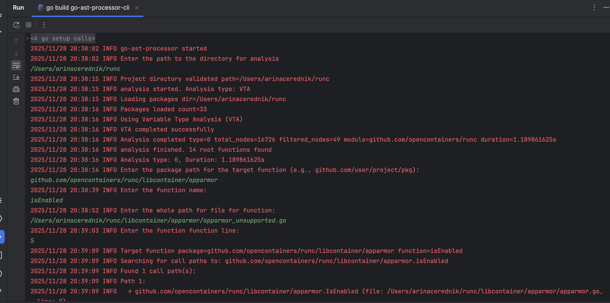
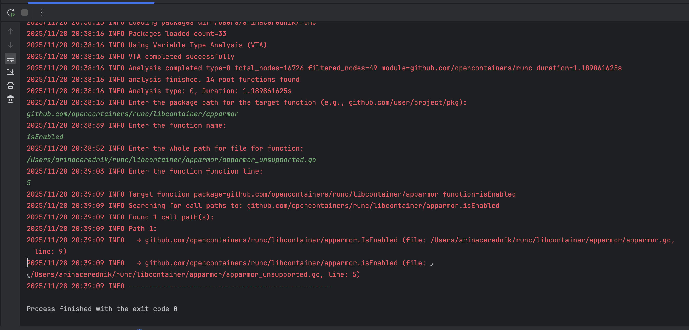
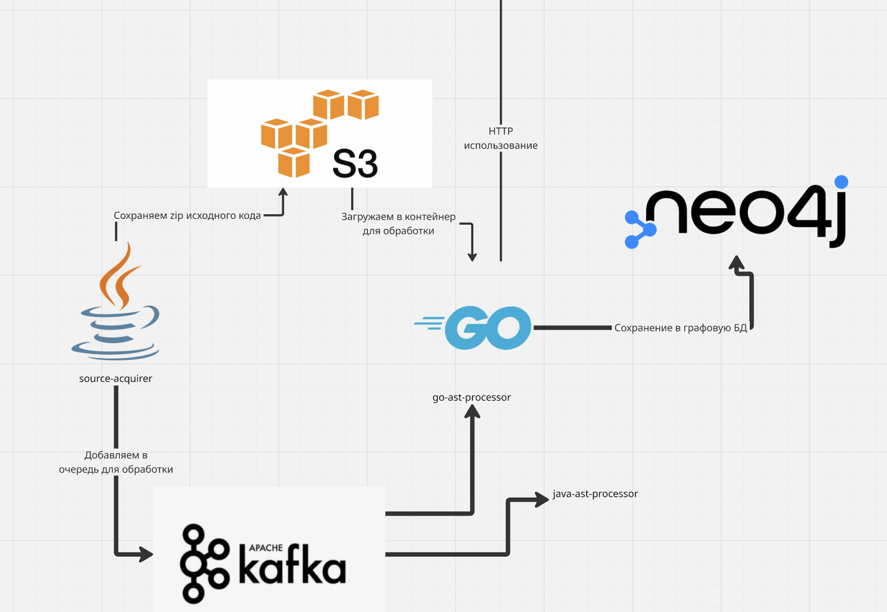

# go-ast-processor-cli

## Инструмент для построения дерева вызовов функций (консольная версия)

### Как пользоваться консольной утилитой?

### Развитие функционала (Микросервисная архитектура)

2 сервиса - source-acquirer (Java) + ast-processor (Go)

Для отображения кода проще всего склонировать репозиторий в S3 - хранилище.
Таким образом, в начале в ci/cd пайплайне вызывается ручка сервиса source-acquirer с ссылкой на gitlab.
Далее, сервис source-acquirer клонирует репозиторий в S3-хранилище и создает задачу в кафке в очереди.

Сервис go-ast-processor вычитывает сообщение из топика, загружает код из временного хранилище и строит граф вызовов в ассинхронном методе. При этом важно, что используется VTA.
Получившийся граф сохраняется в графовую БД.
Далее, через ci/cd осуществляется статический анализ кода, через semgrep, например, отчет отправляется через ручку go-ast-processor, для каждой функции в отчете уязвимостей строится граф с из графовой БД. 
Вызывается третий микросервис для сервера хранения результатов анализа с обьединенным телом ответа от go-ast-processor.

### Как быть с большими проектами? 

Пусть алгоритм анализирует не целиком весь проект с помощью алгоритма VTA, а берет информацию из отчета об уязвимостей информацию о функции.
Находим импорты пакетов в данном файле и затем проводим частичный анализ VTA в рамках конкретных пакетов. 
Далее рассматриваем каждую функцию из графа вызовов, если есть необработанные пакеты в месте определения функции, проводим анализ повторно.
Потенциально, именно этот алгоритм должен быть итоговым, но на первом этапе можно обработать целиком весь проект.
Обработанные пакеты можно сохранять в redis для лучшей производительности до того, как все уязвимые функции будут обработаны.

### Идеи для развития

Потенциальный функционал инструмента:

- [ ] Построение дерева вызовов для одной функции
- [ ] Можно выявить связь между двумя функциями, где, например, одна функция вызывает другую. Для этого нужно просто построить два дерева и обойти каждое из них.
- [ ] Предсказание о конкретной реализации интерфейса функции по дереву вызова, используя информацию о типе.
- [ ] Поиск инициализации переменной

### Про VTA

Алгоритм VTA строит глобальный граф распространения типов, который моделирует потоки данных в программе.
Он передает типы и функциональные литералы по этому графу, чтобы определить, какие типы могут оказаться в каждой переменной. Этот подход позволяет более точно определять возможные получатели динамических вызовов методов.

